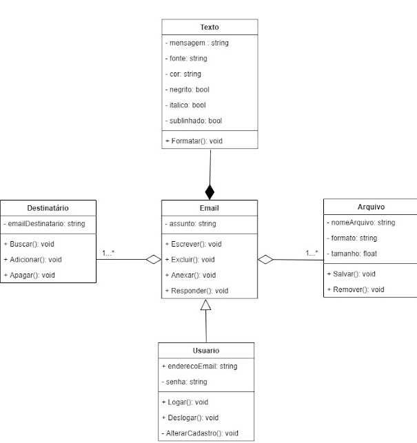

# Exercícios de Interpretação - Orientação a Objeto

Dado os diagramas abaixo, identifique e justifique a presença de elementos dos pilares da orientação a objetos, conforme exemplo abaixo:

## Exemplo

- [x]  Herança
    - R: Email herda propriedades e métodos de Usuário
- [x]  Encapsulamento
    - R: Usuário esconde a propriedade “senha” da subclasse email
- [ ]  Polimorfismo
    - [ ]  Sobrecarga
    - [ ]  Sobrescrita
- [ ]  Abstração

## Exercício 1

Assinale e justifique abaixo os elementos que encontrou neste diagrama:

- [ ]  Herança
- [ ]  Encapsulamento
- [ ]  Polimorfismo
    - [ ]  Sobrecarga
    - [ ]  Sobrescrita
- [ ]  Abstração

## Exercício 2

Assinale e justifique abaixo os elementos que encontrou neste diagrama:

- [ ]  Herança
- [ ]  Encapsulamento
- [ ]  Polimorfismo
    - [ ]  Sobrecarga
    - [ ]  Sobrescrita
- [ ]  Abstração

## Exercício 3

Assinale e justifique abaixo os elementos que encontrou neste diagrama:

- [ ]  Herança
- [ ]  Encapsulamento
- [ ]  Polimorfismo
    - [ ]  Sobrecarga
    - [ ]  Sobrescrita
- [ ]  Abstração