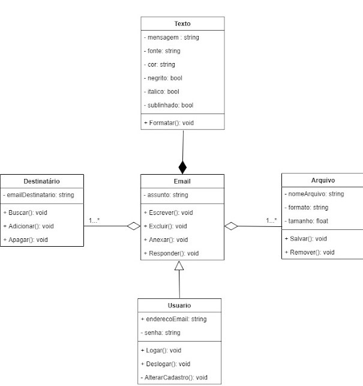
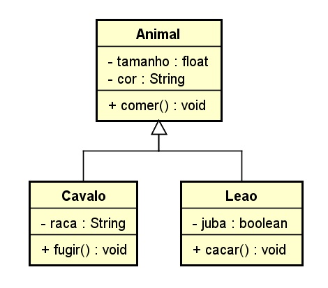

# Exercícios de Interpretação - Orientação a Objeto

Dado os diagramas abaixo, identifique e justifique a presença de elementos dos pilares da orientação a objetos, conforme exemplo abaixo:

## Exemplo

- [x]  Herança
    - R: Email herda propriedades e métodos de Usuário
- [x]  Encapsulamento
    - R: Usuário esconde a propriedade “senha” da subclasse email
- [ ]  Polimorfismo
    - [ ]  Sobrecarga
    - [ ]  Sobrescrita
- [ ]  Abstração

## Exercício 1

Assinale e justifique abaixo os elementos que encontrou neste diagrama:

- [x]  Herança
    - R: Carro e Bicicleta herdam de Veículo
- [ ]  Encapsulamento
- [x]  Polimorfismo
    - [ ]  Sobrecarga
    - [x]  Sobrescrita
        - R: O método Acelarar() é sobrescrito nas duas classes filhas
- [x]  Abstração
    - R: O conceito do Veículo foi abstraído para servir como base para as duas outras classes

## Exercício 2

Assinale e justifique abaixo os elementos que encontrou neste diagrama:

- [x]  Herança
    - R: Cavalo e Leão herdam de Animal
- [x]  Encapsulamento
    - R: Todos os atributos das classes estão privados
- [ ]  Polimorfismo
    - [ ]  Sobrecarga
    - [ ]  Sobrescrita
- [x]  Abstração
    - R: O conceito do Animal foi abstraído para servir como base para as duas outras classes

## Exercício 3

Assinale e justifique abaixo os elementos que encontrou neste diagrama:

- [x]  Herança
    - R: Current Account e Saving Account herdam de Account
- [x]  Encapsulamento
    - R: O método createTransaction() está privado na superclasse Account
- [x]  Polimorfismo
    - [ ]  Sobrecarga
    - [x]  Sobrescrita
        - R: O método withDraw() é sobrescrito na subclasse Current Account
- [x]  Abstração
    - R: O conceito de Account foi abstraído para servir como base para as duas outras classes